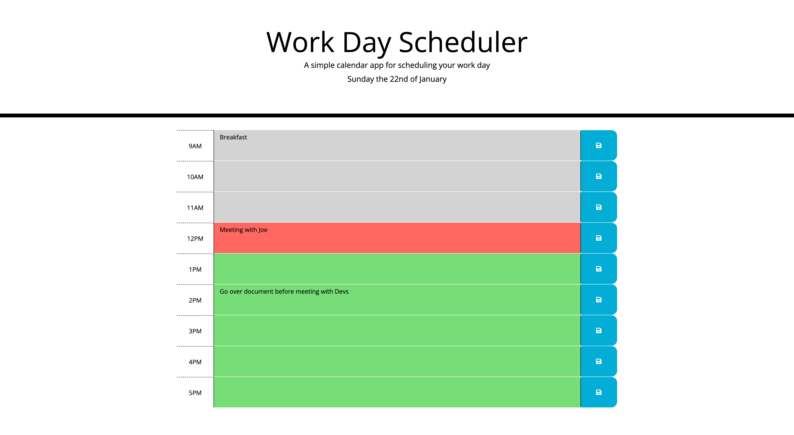

# daily-planner-app

## Description 

Alongside HTML and CSS starter code provided, I have added JavaScript and the integration of moment.js to create a daily planner app. This app will run in the browser and feature dynamically updated HTML and CSS powered by jQuery. The planner app keeps up to date with the present time which is reflected within the timeblocks. It also allows a user to enter an event when they click into a time block, amd save the event in loal storage. 

User story:
AS AN employee with a busy schedule
I WANT to add important events to a daily planner
SO THAT I can manage my time effectively

My motivation behind this was to advance my learning and showcase my skills using DOM manipulation, advanced JavaScript, and integration of third-party APIs.

## Screenshot

## Link
https://sophiedodsworth.github.io/daily-planner-app/

## License 
MIT license